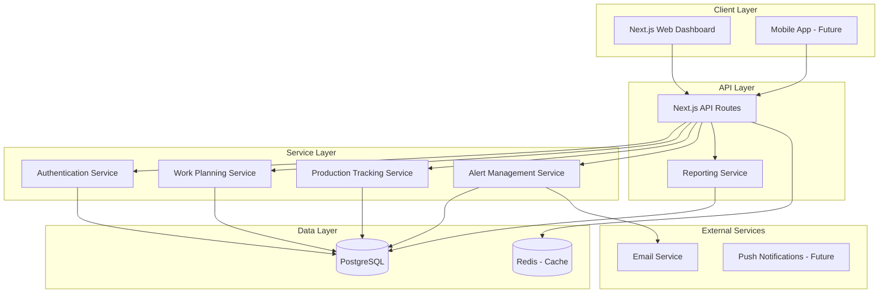
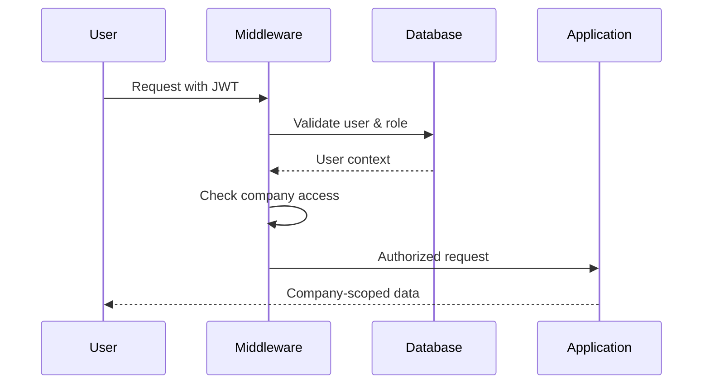
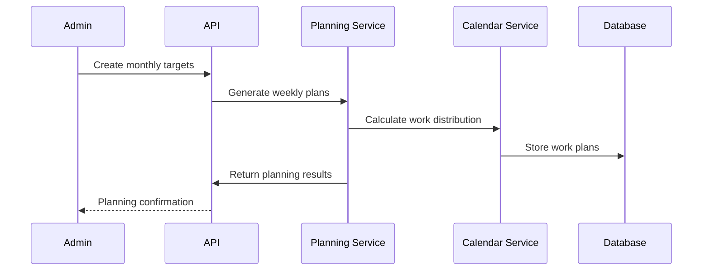
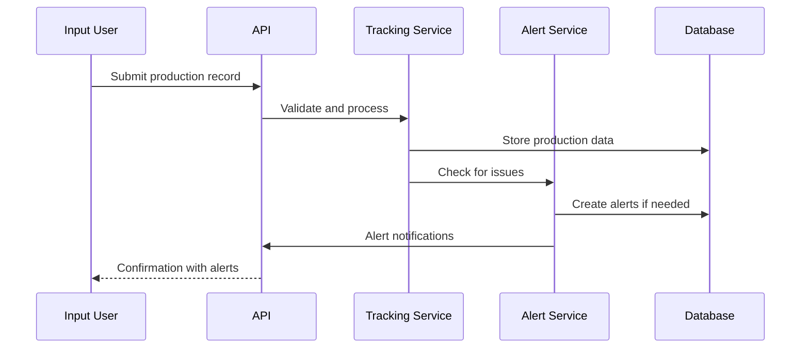
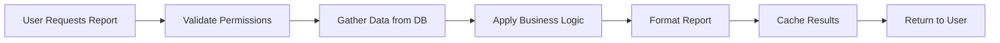
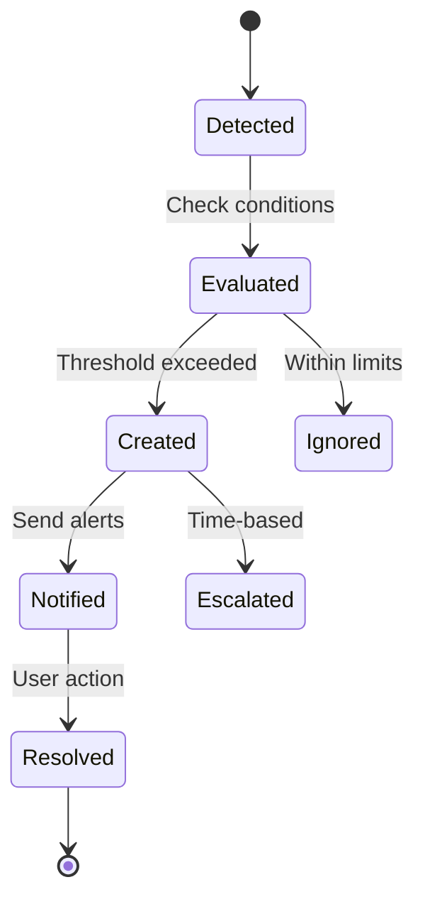

# System Architecture: Production Tracking System

## High-Level Architecture



## Component Architecture

### Frontend (Next.js + shadcn/ui)

```
frontend/
├── app/
│   ├── admin/
│   │   ├── dashboard/         # Main dashboard
│   │   ├── planning/          # Work planning
│   │   ├── tracking/          # Production tracking
│   │   ├── reports/           # Reports and analytics
│   │   └── settings/          # System settings
│   ├── input/
│   │   └── record/            # Data entry interface
│   └── superadmin/
│       └── companies/         # Multi-tenant management
├── components/
│   ├── ui/                    # shadcn/ui components
│   ├── calendar/              # Production calendar
│   ├── forms/                 # Data entry forms
│   ├── charts/                # Analytics charts
│   └── alerts/                # Alert notifications
└── lib/
    ├── api/                   # API client
    ├── calendar/              # Calendar utilities
    └── reports/               # Report generators
```

### Backend (Next.js API + Services)

```
backend/ (integrated in frontend for now)
├── routes/
│   ├── auth.ts                # Authentication
│   ├── companies.ts           # Company management
│   ├── operators.ts           # Operator management
│   ├── planning.ts            # Work planning
│   ├── tracking.ts            # Production tracking
│   ├── alerts.ts              # Alert management
│   └── reports.ts             # Reporting
├── services/
│   ├── planning.service.ts    # Work plan generation
│   ├── tracking.service.ts    # Production recording
│   ├── alert.service.ts       # Alert processing
│   ├── report.service.ts      # Report generation
│   └── calendar.service.ts    # Calendar management
├── middleware/
│   ├── auth.ts                # Authentication middleware
│   ├── tenant.ts              # Multi-tenant middleware
│   ├── role.ts                # Role-based access
│   └── cors.ts                # CORS configuration
└── lib/
    ├── db.ts                  # Database connection
    ├── prisma/                # ORM schemas
    └── utils/                 # Business logic utilities
```

## Multi-Tenant Architecture

### Data Isolation
- **Database Level**: Complete isolation by `company_id`
- **Application Level**: Middleware enforces company boundaries
- **Cache Level**: Redis keys prefixed by company ID

### Role-Based Access Control
```typescript
enum UserRole {
  SUPERADMIN = 'superadmin',  // Cross-company access
  ADMIN = 'admin',           // Company management
  INPUTDATA = 'inputdata'    // Data entry only
}
```

### Access Control Flow


## Production Planning Architecture

### Weekly Planning Flow


### Dynamic Calendar System
- **Base Schedule**: Tuesday-Saturday (5-day work week)
- **Overtime**: Saturday/Sunday optional
- **Adjustments**: Based on targets, holidays, operator availability
- **Rebalancing**: Automatic redistribution when targets missed

## Production Tracking Architecture

### Data Entry Flow


### Quality Control Integration
- **Reject Tracking**: Stage and reason recording
- **Limit Monitoring**: Automatic alerts when thresholds exceeded
- **Remake Workflow**: Notification system for rework requirements

## Reporting Architecture

### Report Types
- **Daily Reports**: Current day production status
- **Weekly Reports**: Target achievement analysis
- **Monthly Reports**: Comprehensive performance review
- **Operator Reports**: Individual performance metrics
- **Product Reports**: Item-specific quality and efficiency

### Report Generation Flow


## Alert System Architecture

### Alert Types
- **Reject Limit Exceeded**: Quality control alerts
- **Target Missed**: Performance monitoring
- **Planning Conflicts**: Schedule issues
- **System Issues**: Technical problems

### Alert Processing


## Security Architecture

### Authentication & Authorization
- **JWT Tokens**: Stateless authentication
- **Role-based Access**: Strict permission controls
- **Company Isolation**: Data access limited to user's company
- **Audit Logging**: All data changes tracked

### Data Protection
- **Encryption**: Sensitive data encrypted at rest
- **Access Controls**: Row-level security
- **Backup Security**: Encrypted backups
- **Data Retention**: Configurable retention policies

## Performance Architecture

### Database Optimization
- **Partitioning**: Time-based partitioning for large tables
- **Indexing Strategy**: Optimized for common queries
- **Connection Pooling**: Efficient database connections
- **Read Replicas**: Future scaling consideration

### Caching Strategy
- **Application Cache**: Frequently accessed reference data
- **Query Cache**: Complex report results
- **Session Cache**: User session data

### Frontend Optimization
- **Lazy Loading**: Component-based loading
- **Virtual Scrolling**: Large data tables
- **Progressive Loading**: Dashboard metrics

## Deployment Architecture

### Development Environment
- **Local PostgreSQL**: Development database
- **Docker Compose**: Full stack development
- **Hot Reload**: Fast development cycle

### Production Environment
- **Vercel**: Frontend deployment
- **Railway/PlanetScale**: Managed PostgreSQL
- **Upstash**: Redis caching
- **Email Service**: SendGrid/Mailgun

### Environment Configuration
```env
DATABASE_URL=postgresql://...
NEXTAUTH_SECRET=...
NEXTAUTH_URL=...
REDIS_URL=redis://...
EMAIL_SERVICE_API_KEY=...
```

## Monitoring & Analytics

### Key Metrics
- **Production Efficiency**: Target achievement rates
- **Quality Metrics**: Reject rates by stage/product
- **System Performance**: Response times and uptime
- **User Activity**: Feature usage analytics

### Logging Strategy
- **Application Logs**: Structured JSON logging
- **Audit Logs**: Data change tracking
- **Performance Logs**: Response time monitoring
- **Error Logs**: Exception tracking with context

### Alert Monitoring
- **System Alerts**: Infrastructure monitoring
- **Business Alerts**: Production threshold alerts
- **Performance Alerts**: Slow query notifications
- **Security Alerts**: Suspicious activity detection